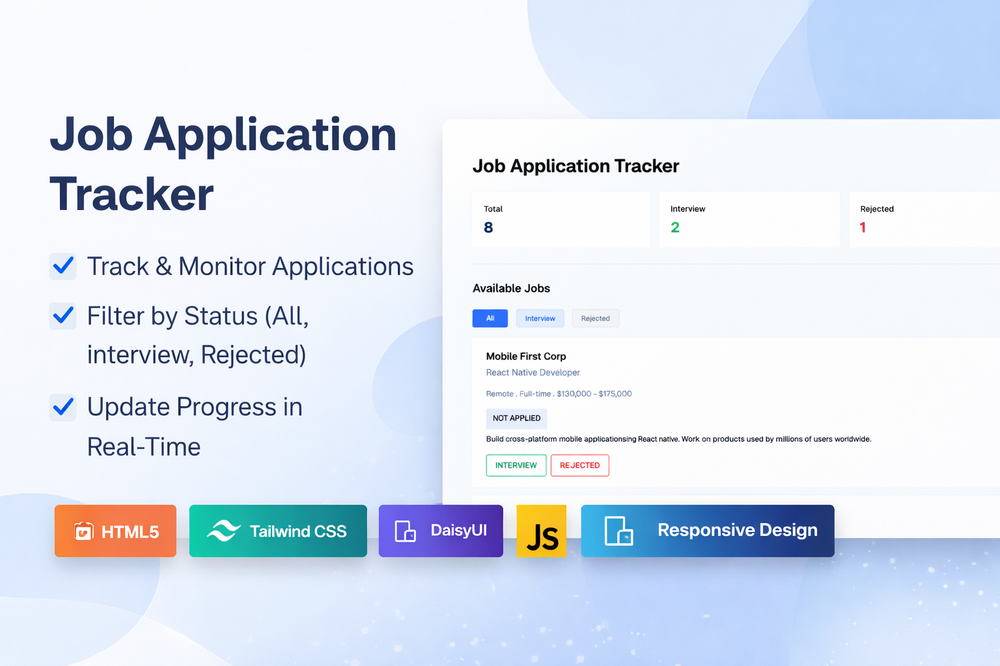

<p align="center">
  
</p>

<h1 align="center">📊 Job Application Tracker</h1>

<p align="center">

<a href="https://rzoshin.github.io/job-application-tracker/">
  
</a>


</p>

---

## 📌 Project Overview

**Job Application Tracker** is a dynamic dashboard-based web application built to manage and monitor job applications efficiently.

The system enables users to track total applications, categorize them by status (All, Interview, Rejected), and update application progress in real time using event-driven state transitions.

---

## 🔗 Live Demo

👉 https://rzoshin.github.io/job-application-tracker/

---

## ✨ Key Features

- 📈 Real-time application count tracking
- 🎯 Status-based filtering:
  - All
  - Interview
  - Rejected
- 🔄 Dynamic state transitions
- 🗂 Interactive job cards
- 🧮 Auto-updating dashboard metrics
- 📱 Fully responsive layout
- 🧩 Empty-state UI handling (No jobs available)

---

## 🛠 Technologies Used

- **HTML5**
- **Tailwind CSS**
- **DaisyUI**
- **Vanilla JavaScript (ES6)**
- DOM Manipulation
- Event-Driven Logic
- Responsive Web Design

---

## 🧠 Core Logic Implementation

This project focuses heavily on front-end state management concepts:

- Dynamic DOM updates
- Event listeners for status transitions
- Conditional rendering based on application state
- Live metric recalculation
- Filtering logic without page reload
- Interactive UI feedback

---

## 🎯 Purpose of the Project

This project was developed to:

- Strengthen JavaScript event handling skills
- Practice front-end state logic
- Build structured dashboard interfaces
- Improve component organization using Tailwind
- Simulate real-world tracking system behavior

---

## 🚀 Future Enhancements

- Persistent storage using LocalStorage
- Backend integration with database
- Add/Edit/Delete job functionality
- Search & sort options
- Authentication system

---

## 👨‍💻 Author

**Raiyan Zannat**  
CSE Graduate | MSc Engineering Candidate |
Focused on Front-End Systems, AI & Intelligent Applications

---

# 📘 JavaScript DOM & Events — Short Notes

---

##  1. What is the difference between getElementById, getElementsByClassName, and querySelector / querySelectorAll?

`getElementById`, `getElementsByClassName`, `querySelector`, `querySelectorAll`

These are DOM selection methods. We use them to find HTML elements using JavaScript.

---

### `getElementById()`

 i. Finds element using id.
 ii. Id is always unique
 iii. Returns one single element.

**Use when:** You know the exact id and only one element is needed.

---

### `getElementsByClassName()`

 i. Finds elements using class name
 ii.Many elements can have same class
 iii. Returns HTMLCollection (array-like list)

---

### `querySelector()`

i. Uses **CSS selector**
ii. Returns **first matching element only**

You can select by:

* id → `#id`
* class → `.class`
* tag → `div`

---

### `querySelectorAll()`

i. Uses **CSS selector**
ii. Returns **all matching elements**
iii. Returns **NodeList**

---

## 2. How do you create and insert a new element into the DOM? 

To add new HTML using JavaScript, we follow 3 steps.

---

### Step 1 — Create element

```
const newDiv = document.createElement("div");
```

### Step 2 — Add content / attributes

```
newDiv.innerText = "Hello I am new here 👋";
newDiv.className = "box";
```

You can also use:

```
newDiv.innerHTML = "<b>Hello</b>";
```

---

### Step 3 — Insert into DOM

```
document.body.appendChild(newDiv);
```

Now the element appears on the webpage.

---


---

## 3. What is Event Bubbling? And how does it work?

Event Bubbling means:

> When an event happens on a child element, it also moves upward to its parent elements.

Like a bubble rising in water

---

### Example Structure

```html
<div id="parent">
  <button id="child">Click Me</button>
</div>
```

---

### JavaScript

```js
document.getElementById("parent")
  .addEventListener("click", () => {
    console.log("Parent clicked");
  });

document.getElementById("child")
  .addEventListener("click", () => {
    console.log("Button clicked");
  });
```

---

### When button is clicked

Output:

```
Button clicked
Parent clicked
```

---

## 4. What is Event Delegation in JavaScript? Why is it useful?

Event Delegation means:

> Adding event listener to a parent element to handle events for its children.

Instead of adding listeners to every child.


### Why Event Delegation is Useful

* Less code
* Better performance
* Handles dynamic elements
* Cleaner structure

---

## 5. What is the difference between preventDefault() and stopPropagation() methods?

`preventDefault()` vs `stopPropagation()`

Both control event behavior but in different ways.

---

### `preventDefault()`

Stops browser’s default action.

Example:

```html
<a href="https://google.com" id="link">Go</a>
```

```js
document.getElementById("link")
  .addEventListener("click", (e) => {
    e.preventDefault();
  });
```

Now link will not open.

---

### Common uses

* Stop form submit
* Stop page reload
* Stop link redirect

---

### `stopPropagation()`

Stops event bubbling.

Example:

```js
document.getElementById("child")
  .addEventListener("click", (e) => {
    e.stopPropagation();
    console.log("Button clicked only");
  });
```

Now parent event will not run.

---


